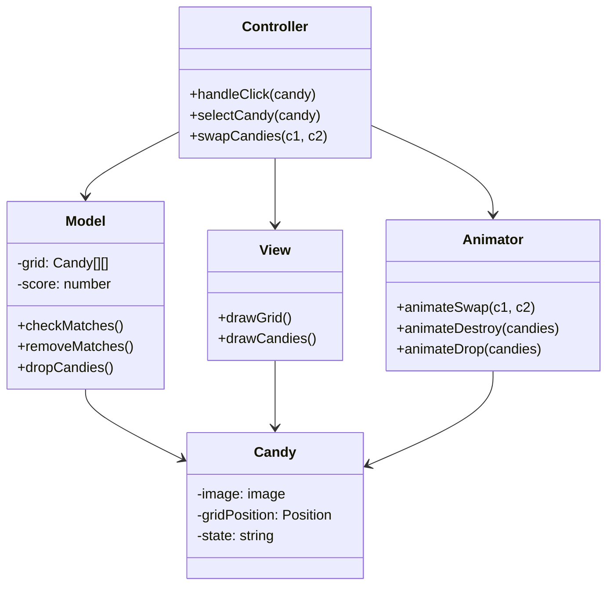
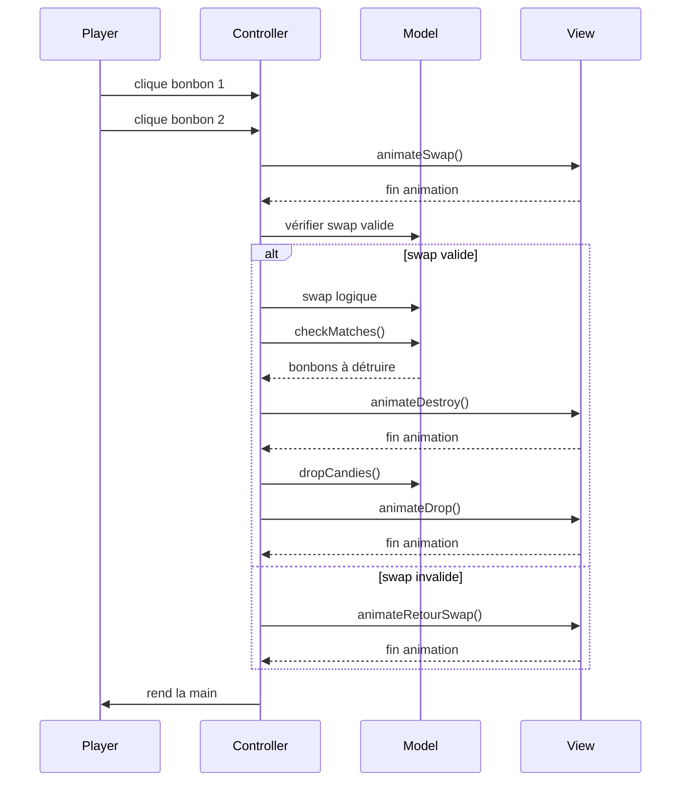
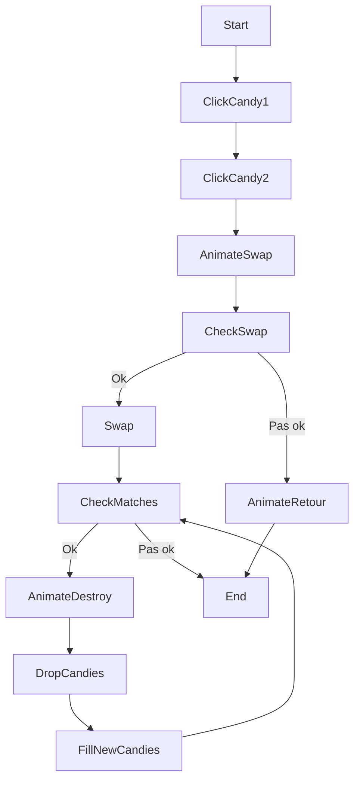

# Préparation du projet Candy Crush Simplifié

## 1. Architecture MVC

On va séparer en trois parties :

- **Modèle** : tout ce qui contient les données et les règles du jeu.
- **Vue** : ce qui s’occupe d’afficher la grille et les bonbons dans le canvas.
- **Contrôleur** : celui qui gère les clics, qui demande au modèle de changer les données et qui appelle la vue pour les animations.

---

## 2. Classes principales

On aura 5 classes reparties entre les 3 parties MVC comme ceci :

- **Modèle**
  - Model
  - Candy
- **Contrôleur**
  - Controller
  - Animator
- **Vue**
  - View

### Controller

- Gère les clics utilisateur.
- Vérifie si les bonbons sélectionnés sont voisins.
- Appelle le modèle pour gérer un swap.
- Lance les animations via Animator.
- Attend la fin des animations avant de continuer le traitement.

### Animator

- S’occupe des animations graphiques : swap, retour si invalide, destruction, chute, apparition des nouveaux bonbons.
- Ne touche pas aux données, juste aux positions visuelles.
- Dit au controleur quand une animation est terminée.

### View

- Dessine la grille sur le canvas.
- Affiche les bonbons selon leur position actuelle.
- Ne connaît pas les règles du jeu.
- Affiche le score.

### Candy

- Contient les données d’un bonbon : image & position.

### Model

- Contient la grille de bonbon (tableau 2D).
- Vérifie les alignements et gère les suppressions.
- Gère la chute des bonbons et le remplissage par le haut.

---

## 3. Diagramme de classes Mermaid

Les getters & setters ne sont pas dans le diagramme.

---

## 4. Diagramme de séquence

---

## 5. Diagramme de flux

---

## The end
